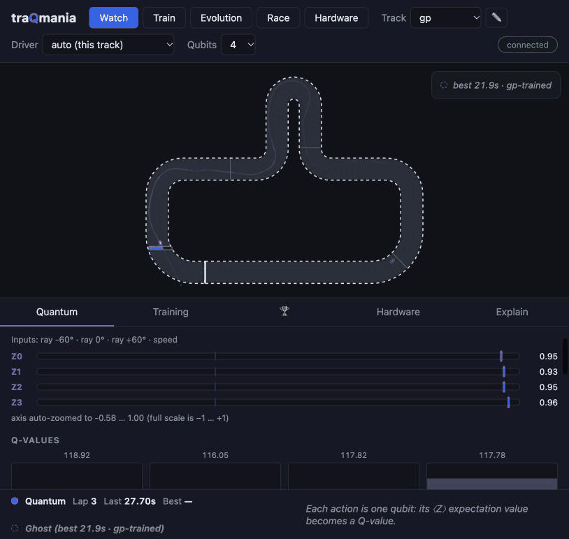

# traQmania 🏎️

**A quantum reinforcement learning demo, Trackmania-style.** Watch a variational
quantum circuit learn to race — then grab the keyboard and try to beat it.



- Quantum Deep Q-Learning (4 qubits / 56 trainable parameters by default; a
  trained 6-qubit / 80-parameter variant ships behind `--profile q6`) built on
  [Qiskit](https://www.ibm.com/quantum/qiskit) and
  [qiskit-machine-learning](https://github.com/qiskit-community/qiskit-machine-learning),
  anchored in [Chen et al., *Variational Quantum Circuits for Deep Reinforcement
  Learning* (IEEE Access 2020)](https://research.ibm.com/publications/variational-quantum-circuits-for-deep-reinforcement-learning).
- Classical numpy baseline with comparable parameter count, trained side-by-side.
- Live training you can watch in minutes, bundled pre-trained weights,
  human-vs-quantum race mode.
- Hardware mode: every steering decision as an Estimator job on a simulated
  IBM device (a local noise-model twin of a Nighthawk or Heron processor, no
  account needed). With an IBM Quantum account the same code submits to a
  real device; no lap on a physical QPU is reported yet.
- Built to be checked: a light-cone analysis that says what each action's
  readout can and cannot see, a multi-seed study harness with bootstrap
  statistics, a noise model validated against the simulated device, a
  classical surrogate of the trained circuit, and a science page that
  reports what does not work.
- Runs on a laptop or a Raspberry Pi; environments based on
  [QuBins](https://qubins.org) images.

## Quick start

```sh
./run.sh                    # venv + install + launch, opens http://127.0.0.1:8000
./run.sh --profile pi5      # Raspberry Pi 5 profile
./run.sh --profile q6       # 6-qubit circuit: 5 lidar rays, 80 parameters
```

Or with Docker (multi-arch, works on a Pi):

```sh
docker run --rm -p 8000:8000 ghcr.io/janlahmann/traqmania
```

Beyond the UI, from a source checkout:

```sh
# Train a driver (recipe: [training] plus the track's preset). Without --out
# the bundled weights are overwritten.
python -m traqmania.train_headless --agent quantum --track gp --seed 0 --out runs/gp
# Any config value can be overridden; --save-final keeps the end-of-training
# parameters next to the best snapshot, --preset none skips the track preset.
python -m traqmania.train_headless --agent quantum --track gp --out runs/gp-huber \
    --set training.loss=huber --set training.target_update=soft --save-final

# One run is an anecdote: a (variant x seed) study with interval statistics.
python tools/study.py run --out runs/study-gp --track gp --seeds 0-9 --jobs 4 \
    --variant base --variant 'huber:training.loss="huber"'
python tools/study.py report runs/study-gp

# What can each action's readout see at this size and depth?
python -m traqmania.agents.quantum.lightcone --qubits 10 --layers 4

# A lap on a simulated IBM device (pip install -e ".[hardware]").
python -m traqmania.hardware lap --track oval --profile q6 --fake
python -m traqmania.hardware lap --track chicane --fake-name fake_fez --resilience 1
python -m traqmania.hardware lap --track oval --profile q6 --fake --no-prune
# The same lap with a per-readout rescale (one extra calibration job), and a
# guarded SPSA sprint on the output head.
python -m traqmania.hardware lap --track oval --profile q6 --fake --rescale readout
python -m traqmania.hardware sprint --track oval --fake --iterations 10

# Train for device noise (wider action gaps, acting under emulated noise),
# then count laps under noise: emulated, and on the simulated device.
python -m traqmania.train_headless --agent quantum --track oval --seed 0 --out runs/oval-robust \
    --set training.action_gap=0.8 --set 'training.act_noise={attenuation=0.95,shots=1024}'
python tools/hw_reliability.py --weights runs/oval-robust/quantum_oval.npz --track oval
```

## Notebooks

Seven teaching notebooks build the whole stack up from scratch — no local install
needed, each badge launches on Binder (via [QuBins](https://qubins.org) `xl`
images with Qiskit preinstalled):

| Notebook | What it covers | Launch |
|---|---|---|
| [01 — The racing environment](notebooks/01_the_racing_env.ipynb) | tracks, car physics (why you must brake for hairpins), lidar, reward, a scripted lap | [](https://qubins.org/launch/?image=latest-xl&repo=https://github.com/JanLahmann/traQmania&branch=main&path=notebooks/01_the_racing_env.ipynb) |
| [02 — Q-learning from scratch](notebooks/02_q_learning_from_scratch.ipynb) | MDPs, double DQN in pure numpy, a 76-parameter MLP learns to lap in seconds | [](https://qubins.org/launch/?image=latest-xl&repo=https://github.com/JanLahmann/traQmania&branch=main&path=notebooks/02_q_learning_from_scratch.ipynb) |
| [03 — Quantum circuits as Q-functions](notebooks/03_quantum_circuits_as_q_functions.ipynb) | the data re-uploading VQC, expressivity, fastsim ≡ `EstimatorQNN`, light cones and dead parameters, adjoint vs param-shift | [](https://qubins.org/launch/?image=latest-xl&repo=https://github.com/JanLahmann/traQmania&branch=main&path=notebooks/03_quantum_circuits_as_q_functions.ipynb) |
| [04 — Training the quantum driver](notebooks/04_training_the_quantum_driver.ipynb) | live quantum DQN training, quantum-vs-classical curves over seeds, lap-time table, honest takeaways | [](https://qubins.org/launch/?image=latest-xl&repo=https://github.com/JanLahmann/traQmania&branch=main&path=notebooks/04_training_the_quantum_driver.ipynb) |
| [05 — Real quantum hardware](notebooks/05_real_quantum_hardware.ipynb) | the simulated Nighthawk device, transpilation, device noise and mitigation, noise-aware training, the guarded SPSA sprint, and laps on simulated IBM Quantum devices | [](https://qubins.org/launch/?image=latest-xl&repo=https://github.com/JanLahmann/traQmania&branch=main&path=notebooks/05_real_quantum_hardware.ipynb) |
| [06 — More qubits or better features?](notebooks/06_scaling_and_features.ipynb) | sensor scaling 4→10 qubits vs engineered observations, learning curves over seeds, matched MLP baselines, the gp failure-and-rescue | [](https://qubins.org/launch/?image=latest-xl&repo=https://github.com/JanLahmann/traQmania&branch=main&path=notebooks/06_scaling_and_features.ipynb) |
| [07 — Light cones and classical surrogates](notebooks/07_light_cones_and_classical_surrogates.ipynb) | what each action's readout can see (blind spots, dead parameters, the pruned hardware circuit), the trained driver as an exact Fourier series (and how little of the allowed spectrum it uses), classical RFF/kernel surrogates fitted from samples that drive its laps, with controls — and what that does and does not mean | [](https://qubins.org/launch/?image=latest-xl&repo=https://github.com/JanLahmann/traQmania&branch=main&path=notebooks/07_light_cones_and_classical_surrogates.ipynb) |

## Measured results (Apple Silicon laptop, physics v2)

> **2026-10-01:** these numbers predate the October 2026 audit. Snapshot
> selection used 4 distinct greedy eval episodes, the headlines rest on 1–3
> seeds, and the 8- and 10-qubit circuits could not show every input to
> every action (light cones — see [docs/SCIENCE.md](docs/SCIENCE.md)). All
> drivers are being retrained and everything below re-measured with the
> multi-seed harness (`tools/study.py`).

<!-- RESULTS-PENDING: replace this note and the tables/numbers of this section with the re-measured multi-seed values -->

All numbers below are measured under the **v2 physics** (2026-07): faster
straights (`v_max` 22 → 25, stronger engine and brakes) with unchanged
hairpin discipline, so speed *varies* visibly — the model-based hero driver's
max/min speed ratio is 1.81 on gp and 1.79 on combo (≈1.5 before), while the
oval and chicane corners are gentle enough to stay flat-out at any of these
speeds. The flip side, reported honestly below: the harder approach speeds
make gp and combo tougher for the 4-qubit circuit — an overnight recipe
sweep won back most of the gp gap (slower epsilon decay; seed-robust,
laps at 3/3 seeds), while fresh training on combo still never laps
(only warm-started runs do).

| Track | Quantum first clean lap | Best lap (greedy best-snapshot) | Classical MLP best lap |
|---|---|---|---|
| oval | ~18 s training (ep ≈ 381) | 14.1 s | 13.2 s |
| chicane | ~25 s training (ep ≈ 450) | 12.5 s | 13.5 s |
| gp | ~123 s training (ep ≈ 1794) | 23.2 s | 20.3 s |
| combo | ~79 s training (ep ≈ 1034, warm-started) | 27.5 s | 30.8 s |

**Scaling qubits vs engineering features** (oval; greedy best-snapshot eval,
bundled driver's seed). Extra qubits widen the observation register: either more lidar rays
("rays + speed") or hand-engineered features (track curvature ahead,
corner-speed ratio, lateral offset, heading error):

| Qubits (profile) | Params | Best oval lap, rays + speed | Best oval lap, engineered features |
|---|---|---|---|
| 4 (default) | 56 | 14.1 s | — (register full: 3 rays + speed) |
| 6 (`q6`) | 80 | 13.3 s | 13.2 s |
| 8 (`q8`) | 104 | 13.3 s | 12.5 s |
| 10 (`q10`) | 128 | **12.0 s** | 13.5 s |

In these runs sample efficiency stayed roughly flat from 4 to 10 qubits
(first clean lap between episode ~200 and ~515 everywhere) — measured, at 8
and 10 qubits, with circuits that hid inputs from actions (see below), so
not a clean scaling statement. What grows reliably is per-decision compute,
as the statevector goes 16 → 1024 amplitudes (fastsim greedy: ≲1 ms per
decision at 4–6 qubits, ~1.2–2 ms at 8, ~5–9 ms at 10). Seed-honesty from
the three-seed spreads: the table quotes seed 42, but the ranges overlap —
the q10 driver's 12.0 s headline is the best of three seeds (spread
12.0–14.2 s), and the apparent feature win at q8 (12.5 s) does not survive
its spread either (12.5–13.8 s vs plain q8's 12.5–13.3 s; details in
docs/SCIENCE.md). The matched MLP baselines (92–124 params,
~0.01 ms/decision) still match or beat every quantum lap — 11.9 s at the
q10 observation vs quantum's 12.0 s is the closest the two have ever been,
but it stays parity, not advantage.
`quantum_oval_q8.npz`, `quantum_chicane_q8.npz`, the q10 pair **and
`quantum_gp_q10.npz`** ship, so the Qubits selector covers oval and chicane
at every size plus gp at 10 qubits. The gp driver was the payoff of a
recipe-transplant campaign: with the swept slow-decay recipe, gp laps
greedily at every qubit count, and at q10 with engineered features it is
pace-competitive with the 4-qubit driver (best 20.0 s vs 20.4 s). It drives
under the observation it was trained on — weight sidecars record their
observation and the server adopts it per driver — while the q6/q8 gp
candidates stay unbundled (they lap, but ~40 s slow; see docs/SCIENCE.md).
combo still ships 4-qubit only. `python -m traqmania.records` evaluates
every bundled driver on every track into `data/records.json` for comparison.

Why don't more qubits buy faster laps? Part of the answer turned out to be
inside the circuit: with 4 re-uploading blocks and a nearest-neighbour CZ
ring, each action's readout only sees inputs within 3 qubits of its own, so
at 8 qubits every action is blind to one input (Brake cannot see speed) and
at 10 qubits to three. Every 8- and 10-qubit number above was measured that
way; `python -m traqmania.agents.quantum.lightcone` prints the map, and the
re-measurement uses enough blocks (5 and 6).
<!-- RESULTS-PENDING: 8/10-qubit results with full visibility -->
The earlier analysis (docs/SCIENCE.md, "Making qubits matter") found four
more bottlenecks outside the circuit, and the stack addresses each:
a **qubit-scaled action readout** (6/8 actions —
trail braking, half-steer — read off the first *k* qubits, `--actions` in
`train_headless`; the 4-action default stays bit-identical), **multi-horizon
curvature sensing** (`"curvature_ahead:30"`-style features — braking from
v_max needs ~17 m, more than the old 15 m lookahead could see), a
**pace fine-tune phase** (`--pace`: per-decision time penalty at low
epsilon, so the objective becomes lap time), and **reliability-first
snapshot selection** (ranking by lapped episodes and mean lap over 12
distinct greedy episodes instead of a 4-episode lucky-lap check). First
measurements (one seed): the pace fine-tune is the
clear win — it took the 10-qubit gp driver from 22.3 s mean / 20.0 s best
to **20.2 s mean / 17.5 s best** (the first quantum gp lap under 18 s;
reliability drops 25/36 → 14/36, so the steadier driver stays bundled).
The scaled action sets drove an 18.9 s exploration lap but don't yet
converge greedily — they need their own training recipe (honest details
in docs/SCIENCE.md).

**One driver, every track**: the bundled **universal** driver — a single
4-qubit circuit trained on all four tracks round-robin (3000 episodes),
warm-started from its physics-v1 predecessor — laps oval (13.0 s), chicane
(13.3 s), gp (30.3 s), combo (52.3 s) *and* 10/10 unseen generated tracks at
medium difficulty (best 23.0 s). The egocentric lidar-and-speed observation
is what makes the transfer work; specialists stay faster at home. Honest
notes: under the v2 physics, *fresh* multi-track training no longer produces
a fully universal driver (4 runs tried — the best laps oval/chicane and 9/10
generated tracks but fails gp and combo outright); warm-migrating the old
universal driver into the new physics is what preserves full coverage, at
the price of slow laps on the two hard tracks — and that migration worked at
one seed of three (the other two collapse to oval specialists; see
docs/SCIENCE.md).

Why we train on a simulator and run inference on hardware: one double-DQN update is
**~3.4 ms** with the numpy statevector + adjoint path vs **~20.5 s** with
parameter-shift gradients through `EstimatorQNN` — a ~6,000× gap, before any queue
time (timed before the October 2026 stack upgrade). Inference under noise is not a solved problem here: the default
4-qubit oval driver does not complete a lap on the simulated device (0 of 14
runs on `fake_miami`), and 1024-shot sampling alone already cuts it to 9
laps in 30 attempts, while the 6-qubit oval driver lapped in 13 of 13
device runs and the chicane driver in 12 of 20 (numbers and protocol in
docs/SCIENCE.md, "Hardware"). An earlier version of this README said the
trained policy "still laps" under shots and device noise; for the default
driver that was wrong. Why it fails and what helps is now measured for the
4-qubit oval (docs/SCIENCE.md, "Why it fails, and what helps"): the default
driver decides on margins of about one standard deviation of 1024-shot
noise. More shots and a per-readout rescale (`--rescale readout`) restore
drivers with moderate margins, but not this one. Training for wider action
gaps under emulated device noise (`training.action_gap`,
`training.act_noise`) gave a driver that laps on the simulated device in 5
of 8 fresh seeds, against 1 of 8 for the default recipe — and did not learn
to lap in about one seed in five. No bundled driver has been retrained that
way yet.
<!-- RESULTS-PENDING: noise survival of the retrained drivers -->

The hardware path itself is current: client-side Estimator with an
`EstimatorV2` fallback, explicit error-mitigation level (`--resilience 0|1|2`,
default 0 = raw noise), a Session → Batch → job fallback for accounts that
cannot open a Session (the free Open Plan: job and batch mode only, 10
QPU-minutes per 28 days), and `fake_miami` — a calibration snapshot of a
Nighthawk processor — as the default simulated device. The circuit's CZ ring fits the
Nighthawk square lattice with zero SWAPs (16 CZ at 4 qubits, 12 after
light-cone pruning; 37 and 27 when routed onto a heavy-hex Heron).
`--fake-name` selects any other fake, including the retired Falcons;
`--no-prune` runs the full circuit.

## Modes

<!-- RESULTS-PENDING: driver performance quoted in the mode blurbs below (universal driver 10/10 on generated tracks, warm-start "in seconds", which hardware-mode drivers lap) after the retrain -->

- **Watch** (attract): the trained 4-qubit agent drives; live ⟨Z⟩ gauges, Q-values,
  and the circuit diagram update as it decides. A driver picker swaps in any
  bundled training — watch the gp-trained specialist lap the oval zero-shot, or
  the **universal** driver (trained on all four tracks at once) take on any of
  them.
- **Surprise tracks**: pick 🎲 random in the track menu for a procedurally
  generated track with real hairpins and chicanes — fresh every roll, or type a
  seed to reload a favourite, with short/medium/long size presets. The universal
  driver laps unseen generated tracks zero-shot (10/10 at medium difficulty).
- **Draw your own**: hit ✏️ and sketch a loop right on the race view — the
  server smooths it into a drivable track and the universal driver takes it
  on. Impossible drawings (open strokes, crossings, razor hairpins) come back
  with a hint about what to fix; just draw again.
- **Train**: watch quantum and classical agents learn side-by-side (warm-start mode
  reaches a first clean lap in seconds).
- **Race**: arrow keys / WASD or a gamepad (analog steering, trigger
  throttle/brake) — race the quantum agent.
- **Evolution**: training snapshots of the same quantum agent race each other
  (three mid-training checkpoints plus the shipped best driver) — watch the
  policy improve across checkpoints.
- **Hardware**: run a lap or a bounded, guarded SPSA sprint on a simulated
  IBM device (local, no account) or a real IBM Quantum backend, with live
  status — backend, execution mode, two-qubit gate count — then replay the
  run as a ghost next to a simulator car on the same weights. Needs the
  `[hardware]` extra; a real backend also needs a saved IBM Quantum account.
  Expect the default 4-qubit oval driver to leave the track early under
  device noise — see the [exhibition runbook](docs/EXHIBITION.md) for what
  works.

## Documentation

- [Exhibition runbook](docs/EXHIBITION.md) — laptop/Pi/kiosk setups, a scripted
  5-minute demo, per-mode talking points, hardware-mode prerequisites,
  troubleshooting.
- [Architecture](docs/ARCHITECTURE.md) — system overview, module map, the
  complete WebSocket protocol reference, data-flow rates, and how to add a
  track / agent / mode.
- [The science](docs/SCIENCE.md) — the circuit and its light cones, the
  training and snapshot-eval protocol, the hardware path, measured results,
  the October 2026 audit corrections, what this demo does *not* claim, and
  the literature (QRL benchmarking, classical surrogates, noise) it is
  measured against.
- [Notebooks](#notebooks) — the seven-part build-it-from-scratch course above.

<!-- FWQ-FAMILY:START format=list — generated from family.json in JanLahmann/Fun-with-Quantum, do not edit by hand -->
## Part of the Fun with Quantum family

This project is part of [**Fun with Quantum**](https://fun-with-quantum.org), a family of open-source quantum outreach projects: [Fun with Quantum](https://fun-with-quantum.org) · [RasQberry Two](https://rasqberry.org) · [RasQberry One](https://rasqberry.one) · [Quantego](https://quantego.org) · [Qutie](https://qutie.org) · [Qoffee-Maker](https://qoffee-maker.org) · [Entangible](https://entangible.org) · [CertiQ](https://certiq.dev) · [QuBins](https://qubins.org) · [doQumentation](https://doqumentation.org) · [QAMPoser](https://qamposer.org).

*God does play dice. Come play, build, learn.*
<!-- FWQ-FAMILY:END -->

## License

[Apache 2.0](LICENSE) — © 2026 Jan Lahmann.
