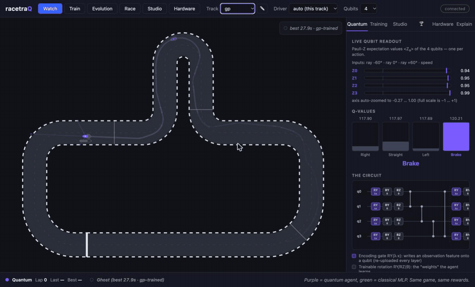

# racetraQ 🏎️

**A quantum reinforcement learning racing demo.** Watch a variational
quantum circuit learn to race — then grab the keyboard and try to beat it.



- Quantum Deep Q-Learning (4 qubits / 56 trainable parameters by default; a
  trained 6-qubit / 80-parameter variant ships behind `--profile q6`) built on
  [Qiskit](https://www.ibm.com/quantum/qiskit) and
  [qiskit-machine-learning](https://github.com/qiskit-community/qiskit-machine-learning),
  anchored in [Chen et al., *Variational Quantum Circuits for Deep Reinforcement
  Learning* (IEEE Access 2020)](https://research.ibm.com/publications/variational-quantum-circuits-for-deep-reinforcement-learning).
- Classical numpy baseline with comparable parameter count, trained
  side-by-side — and, measured over 8–10 seeds, ahead of the circuit on most
  metrics ([Measured results](#measured-results-october-2026-multi-seed)).
- Live training you can watch in minutes, bundled pre-trained weights,
  human-vs-quantum race mode.
- Hardware mode: every steering decision as an Estimator job on a simulated
  IBM device (a local noise-model twin of a Nighthawk or Heron processor, no
  account needed). The bundled 4-qubit oval and chicane drivers are trained
  for device noise and complete their laps there. With an IBM Quantum account
  the same code submits to a real device: on 2026-10-03 the oval driver
  completed one full lap on IBM's `ibm_marrakesh` (141 decisions, 14.1 s,
  raw device noise; docs/SCIENCE.md, "Hardware").
- Built to be checked: a light-cone analysis that says what each action's
  readout can and cannot see, a multi-seed study harness with bootstrap
  statistics, bundled drivers chosen from those studies by a recorded rule
  (per-seed data in `data/studies/`), a noise model validated against the
  simulated device, a classical surrogate of the trained circuit, and a
  science page that reports what does not work.
- Runs on a laptop or a Raspberry Pi; environments based on
  [QuBins](https://qubins.org) images.

## Quick start

```sh
./run.sh                    # venv + install + launch, opens http://127.0.0.1:8000
./run.sh --profile pi5      # Raspberry Pi 5 profile
./run.sh --profile q6       # 6-qubit circuit: 5 lidar rays, 80 parameters
```

Or with Docker (multi-arch, works on a Pi):

```sh
docker run --rm -p 8000:8000 ghcr.io/janlahmann/racetraq
```

Beyond the UI, from a source checkout:

```sh
# Train a driver (recipe: [training], the track's preset, then the agent's
# preset for that track). Without --out the bundled weights are overwritten.
python -m racetraq.train_headless --agent quantum --track gp --seed 0 --out runs/gp
# Any config value can be overridden; --save-final keeps the end-of-training
# parameters next to the best snapshot, --preset none skips the presets.
python -m racetraq.train_headless --agent quantum --track gp --out runs/gp-huber \
    --set training.loss=huber --set training.target_update=soft --save-final

# One run is an anecdote: a (variant x seed) study with interval statistics.
python tools/study.py run --out runs/study-gp --track gp --seeds 0-9 --jobs 4 \
    --variant base --variant 'huber:training.loss="huber"'
python tools/study.py report runs/study-gp
# From a study to a bundled driver: rank the seeds, re-evaluate the best on
# fresh episodes, write weights + sidecar (--dry-run: only report).
python tools/bundle_driver.py --study runs/study-gp --list
python tools/bundle_driver.py --study runs/study-gp --variant base --name quantum_gp --dry-run
# A committable summary of the study (report + per-seed eval logs).
python tools/export_study.py runs/study-gp --name my_gp_study --out runs/summaries

# What can each action's readout see at this size and depth?
python -m racetraq.agents.quantum.lightcone --qubits 10 --layers 4

# A lap on a simulated IBM device (pip install -e ".[hardware]").
python -m racetraq.hardware lap --track oval --profile q6 --fake
python -m racetraq.hardware lap --track chicane --fake-name fake_fez --resilience 1
python -m racetraq.hardware lap --track oval --profile q6 --fake --no-prune
# The same lap with a per-readout rescale (one extra calibration job), and a
# guarded SPSA sprint on the output head.
python -m racetraq.hardware lap --track oval --profile q6 --fake --rescale readout
python -m racetraq.hardware sprint --track oval --fake --iterations 10

# On oval and chicane the quantum recipe trains for device noise (wider
# action gaps, acting under emulated noise). Count laps under noise:
# emulated, and on the simulated device.
python -m racetraq.train_headless --agent quantum --track oval --seed 0 --episodes 800 --out runs/oval
python tools/hw_reliability.py --weights runs/oval/quantum_oval.npz --track oval \
    --shots 1024 --rescale off --resilience 0 --device-episodes 12

# Every bundled driver on every track, 36 fresh episodes per cell.
python -m racetraq.records --episodes 36 --seed 47000 --out runs/records.json
```

## Notebooks

Seven teaching notebooks build the whole stack up from scratch — no local install
needed, each badge launches on Binder (via [QuBins](https://qubins.org) `xl`
images with Qiskit preinstalled):

| Notebook | What it covers | Launch |
|---|---|---|
| [01 — The racing environment](notebooks/01_the_racing_env.ipynb) | tracks, car physics (why you must brake for hairpins), lidar, reward, a scripted lap | [](https://qubins.org/launch/?image=latest-xl&repo=https://github.com/JanLahmann/racetraQ&branch=main&path=notebooks/01_the_racing_env.ipynb) |
| [02 — Q-learning from scratch](notebooks/02_q_learning_from_scratch.ipynb) | MDPs, double DQN in pure numpy, a 76-parameter MLP learns to lap in seconds | [](https://qubins.org/launch/?image=latest-xl&repo=https://github.com/JanLahmann/racetraQ&branch=main&path=notebooks/02_q_learning_from_scratch.ipynb) |
| [03 — Quantum circuits as Q-functions](notebooks/03_quantum_circuits_as_q_functions.ipynb) | the data re-uploading VQC, expressivity, fastsim ≡ `EstimatorQNN`, light cones and dead parameters, adjoint vs param-shift | [](https://qubins.org/launch/?image=latest-xl&repo=https://github.com/JanLahmann/racetraQ&branch=main&path=notebooks/03_quantum_circuits_as_q_functions.ipynb) |
| [04 — Training the quantum driver](notebooks/04_training_the_quantum_driver.ipynb) | one live quantum-vs-classical training run, then the same recipes over 8–10 seeds with interval statistics, the stabilisation study on gp, and how a run becomes the bundled driver | [](https://qubins.org/launch/?image=latest-xl&repo=https://github.com/JanLahmann/racetraQ&branch=main&path=notebooks/04_training_the_quantum_driver.ipynb) |
| [05 — Real quantum hardware](notebooks/05_real_quantum_hardware.ipynb) | the simulated Nighthawk device, transpilation, device noise and mitigation, noise-aware training, the guarded SPSA sprint, and laps on simulated IBM Quantum devices | [](https://qubins.org/launch/?image=latest-xl&repo=https://github.com/JanLahmann/racetraQ&branch=main&path=notebooks/05_real_quantum_hardware.ipynb) |
| [06 — More qubits or better features?](notebooks/06_scaling_and_features.ipynb) | what a wider circuit changes (observation, parameters, light cone), oval and chicane at 4, 6 and 8 qubits against matched MLPs over many seeds, 8 qubits at 4 against 5 blocks, gp at 10 qubits, and what the July feature experiments did and did not show | [](https://qubins.org/launch/?image=latest-xl&repo=https://github.com/JanLahmann/racetraQ&branch=main&path=notebooks/06_scaling_and_features.ipynb) |
| [07 — Light cones and classical surrogates](notebooks/07_light_cones_and_classical_surrogates.ipynb) | what each action's readout can see (blind spots, dead parameters, the pruned hardware circuit), the trained driver as an exact Fourier series (and how little of the allowed spectrum it uses), classical RFF/kernel surrogates fitted from samples that drive its laps, with controls — and what that does and does not mean | [](https://qubins.org/launch/?image=latest-xl&repo=https://github.com/JanLahmann/racetraQ&branch=main&path=notebooks/07_light_cones_and_classical_surrogates.ipynb) |

## Measured results (October 2026, multi-seed)

Every number in this section comes from the multi-seed studies of
2026-10-01/02 (`tools/study.py`, 8–10 seeds per recipe at 4 qubits), run
after a soundness audit. `x [a, b]` is an interquartile mean over seeds
with its 95 % bootstrap interval. Per-seed data: [`data/studies/`](data/studies);
protocol, all tables and the caveats: [docs/SCIENCE.md](docs/SCIENCE.md).
The July 2026 numbers this section used to show rested on one to three
seeds and are withdrawn.

**The honest headline: the classical baseline is ahead.** Same double DQN,
same observation, a 56-parameter circuit against a 76-parameter MLP, each
under the recipe that ships for it:

| Track | Agent | Seeds | Stability | Best-snapshot mean lap | First clean lap (episode) |
|---|---|---|---|---|---|
| oval | circuit | 10 | 0.75 [0.52, 0.92] | 13.7 s [13.2, 14.1] | 264 [236, 341] |
| oval | MLP | 8 | 0.94 [0.87, 0.99] | 12.9 s [12.6, 13.2] | 153 [134, 168] |
| chicane | circuit | 10 | 0.63 [0.49, 0.73] | 13.6 s [13.0, 14.3] | 355 [247, 478] |
| chicane | MLP | 8 | 0.97 [0.93, 0.99] | 13.9 s [13.5, 14.1] | 183 [160, 196] |
| gp | circuit | 10 | 0.17 [0.12, 0.22] | 35.0 s [30.8, 40.1] | 1768 [1690, 1916] |
| gp | MLP | 10 | 0.14 [0.05, 0.21] | 25.4 s [23.3, 28.1] | 1868 [1761, 1979] |
| combo | circuit | 10 | 0.15 [0.03, 0.27] | 46.4 s [42.3, 50.1] | 1563 [1382, 2108] |
| combo | MLP | 10 | 0.08 [0.03, 0.14] | 28.6 s [26.7, 32.6] | 1505 [1391, 1630] |

(Stability: after a run's greedy evaluation has lapped once, the fraction
of later evaluation episodes that still lap; 1 = it keeps what it learned.)
On oval and chicane the MLP drives its first clean lap in about half the
episodes and holds on to it. On gp and combo its laps are about 10 s and
18 s faster, and neither agent is stable: the saved driver is the best
snapshot along the way, and the parameters at the end of training lap in
almost none of 36 test episodes for either. The earlier "parity" reading
does not survive 8–10 seeds. One thing goes the circuit's way: on gp its
runs reach a lapping greedy policy in about half the MLP's episodes — a
slower policy, and one training does not keep.

**What the circuit does show.** It learns all four tracks from scratch, and
one 4-qubit circuit learns all four at once. The bundled drivers are one
seed each, picked from those studies by a fixed rule
(`tools/bundle_driver.py`) and re-evaluated on fresh episodes: each laps in
72 of 72, at a mean lap of 12.7 s (oval), 12.6 s (chicane), 27.9 s (gp) and
37.1 s (combo); the bundled MLPs: 12.6 / 13.3 / 22.5 / 36.9 s. Reliability
ranks before pace in that choice (the bundled combo MLP is a 36.9 s seed
that lapped every time, not the 25.6 s seed that missed one episode in
72). The rule, the spread over seeds and the fresh evaluation
are recorded in each `racetraq/weights/<name>.meta.json`;
`python -m racetraq.records` evaluates every bundled driver on every
track.

**Training stability.** A 29-variant study on gp (6–10 seeds each) found no
optimizer setting that makes the circuit's training stable: Huber loss,
soft target updates, learning-rate decay, per-group learning rates, reward
scaling, a larger replay buffer and slower target sync all failed to help,
and several hurt. What the data showed instead is that the circuit drives
best while it is still exploring and collapses when epsilon reaches 0.05,
whereas the MLP only improves once exploration is low. A 0.30 exploration
floor removes that collapse for the 4-qubit circuit (stability 0.18
against 0.08), while the MLP tends to do worse under it (3 of 10 seeds
reach a snapshot that laps in half its test episodes, against 7 of 10 at
0.05 — a consistent trend, not a supported difference), so the training
recipe is now per agent (`[training_presets_quantum.<track>]`).
It is not universal either: the 10-qubit engineered-feature circuit does
not learn gp under it (3 seeds per depth).

**Qubits and depth** (oval and chicane, one recipe, 800 episodes; stability
and best-snapshot mean lap):

| Circuit | Params | Seeds | Oval | Chicane |
|---|---|---|---|---|
| 4 qubits, 4 blocks | 56 | 8 | 0.69 [0.57, 0.75], 13.9 s | 0.47 [0.41, 0.55], 13.9 s |
| 6 qubits, 4 blocks (`q6`) | 80 | 8 | 0.75 [0.58, 0.85], 13.3 s | 0.68 [0.45, 0.83], 13.4 s |
| 8 qubits, 4 blocks | 104 | 6 | 0.46 [0.20, 0.66], 14.2 s | 0.41 [0.28, 0.74], 13.3 s |
| 8 qubits, 5 blocks (`q8`) | 128 | 6 | 0.53 [0.45, 0.65], 14.4 s | 0.47 [0.31, 0.65], 13.2 s |
| 10 qubits, 4 blocks | 128 | 6 | 0.42 [0.27, 0.50], 14.3 s | 0.46 [0.31, 0.70], 13.6 s |
| 10 qubits, 6 blocks (`q10`) | 188 | 6 | 0.51 [0.26, 0.63], 13.3 s | 0.45 [0.32, 0.66], 13.1 s |
| MLP with 3 / 5 / 7 rays | 76 / 92 / 108 | 8 / 8 / 6 | 0.94 / 0.87 / 0.91, 12.9 / 12.8 / 12.7 s | 0.97 / 0.89 / 0.95, 13.9 / 14.0 / 12.9 s |
| MLP with 9 rays | 124 | 6 | 0.89 [0.87, 0.93], 12.6 s | 0.93 [0.80, 0.98], 12.7 s |

Why don't more qubits buy faster laps? Part of the answer was inside the
circuit. With 4 re-uploading blocks and a nearest-neighbour CZ ring, each
action's readout only sees inputs within 3 qubits of its own, so at 8
qubits every action is blind to one input (Brake cannot see speed) and at
10 qubits to three; `python -m racetraq.agents.quantum.lightcone` prints
the map. Giving the 8-qubit circuit a fifth block made its end-of-training
parameters lap more often on the oval (0.88 [0.62, 0.99] of the test
episodes against 0.36 [0.05, 0.60] — the one supported difference of ten
comparisons at 6 seeds per depth; the rest point the same way without
support), and the `q8` profile and its bundled drivers now have five. It
still gains nothing over 6 qubits, which
is where the circuit does best — and where its chicane laps are level with
the matched MLP's. Seven rays make the MLP about 1 s faster on chicane; the
extra qubits make the circuit no faster on either track. At 10 qubits
on the oval a sixth block points the same way as the fifth at 8 qubits
(end-of-training parameters lap in 0.68 [0.19, 1.00] of the test episodes
against 0.36 [0.06, 0.85]) without the difference being supported at 6
seeds; on chicane the two depths are indistinguishable (0.55 vs 0.55
end-of-training lapped, 13.1 vs 13.6 s), and neither depth is as stable as
the 6-qubit circuit. The `q10` profile therefore runs 6 blocks (full
visibility costs nothing measurable) and its bundled oval and chicane
drivers are 6-block files (72 of 72 test episodes, 13.3 s and 12.6 s).
`quantum_gp_q10` is still the July file: a single 4-block run on an
engineered-feature observation that laps gp in 24 of 36 test episodes at
22.2 s; under the recipe that now ships for 4-qubit gp neither depth learns
the track at 10 qubits.
The mechanisms an earlier campaign added for larger registers remain in the
code and were not re-measured: engineered observation features
(`[observation] features`), a qubit-scaled action readout (`--actions 6|8`)
and a pace fine-tune (`--pace`); see docs/SCIENCE.md, "July 2026
exploratory results".

**One driver, every track — with a catch**: the bundled **universal**
driver is a single 4-qubit circuit trained from scratch on all four tracks
round-robin (3000 episodes, 5 seeds). The seed that ranks first on those
four tracks (144 of 144 fresh episodes at 13.7 / 13.9 / 32.2 / 41.5 s) does
**not** generalize beyond them — on ten generated tracks it completes no
lap (0 of 120 episodes) and in the demo's random-track mode it brakes to a
stop — so the bundled file is seed 3 instead, chosen by hand: it laps every
bundled track (143 of 144 fresh episodes at 27.7 / 27.4 / 35.3 / 38.5 s)
and every generated one (240 of 240), at about twice the easy-track lap
time. Ranking seeds on unseen tracks as well is an open item
(docs/SCIENCE.md, "One driver, every track"). The hard-track specialists
transfer better: the gp driver laps oval and chicane in 36 of 36 episodes
each, combo in 16–22 of 36 (three sets), and every generated track we
tried — three sets of ten, 120 of 120 each.

Why we train on a simulator and run inference on hardware: one double-DQN
update is **~3.4 ms** with the numpy statevector + adjoint path vs
**~20.5 s** with parameter-shift gradients through `EstimatorQNN` — a
~6,000× gap, before any queue time (timed before the October 2026 stack
upgrade).

**Under device noise.** This used to be the weak spot: the 4-qubit oval
driver bundled before October 2026 completed no lap in 14 logged runs on
the simulated device, because its best and second-best action values sat
about one standard deviation of 1024-shot noise apart. Margins can be
trained. The quantum recipe for oval and chicane now uses advantage
learning and acts under emulated device noise (`training.action_gap`,
`training.act_noise`), and the bundled 4-qubit oval and chicane drivers and
the 6-qubit oval driver each lap in 24 of 24 episodes on `fake_miami` at
1024 raw shots (and in 48 of 48 on three further sets of episodes).
Over every seed of the studies, nothing selected, 10 of 10 oval and 8 of
10 chicane seeds lap in at least 11 of 12 device episodes with that recipe,
against 5 of 8 and 0 of 8 without it. The caveats: this is a simulated
calibration snapshot, not a QPU; one chicane seed in ten still failed
badly; and the drivers that were not trained this way are a gamble on the
device (gp laps in 9 of 12 episodes, combo in 4 of 12, the universal
driver in 9 of 12 on the oval and 3 of 12 on chicane). Details:
docs/SCIENCE.md, "Hardware".

The hardware path itself is current: client-side Estimator with an
`EstimatorV2` fallback, explicit error-mitigation level (`--resilience 0|1|2`,
default 0 = raw noise), a Session → Batch → job fallback for accounts that
cannot open a Session (the free Open Plan: job and batch mode only, 10
QPU-minutes per 28 days), and `fake_miami` — a calibration snapshot of a
Nighthawk processor — as the default simulated device. The circuit's CZ ring fits the
Nighthawk square lattice with zero SWAPs (16 CZ at 4 qubits, 12 after
light-cone pruning; 37 and 27 when routed onto a heavy-hex Heron).
`--fake-name` selects any other fake, including the retired Falcons;
`--no-prune` runs the full circuit.

## Modes

- **Watch** (attract): the trained 4-qubit agent drives; live ⟨Z⟩ gauges, Q-values,
  and the circuit diagram update as it decides. A driver picker swaps in any
  bundled training — watch the gp-trained specialist lap the oval zero-shot, or
  the **universal** driver (trained on all four tracks at once) take on any of
  them.
- **Surprise tracks**: pick 🎲 random in the track menu for a procedurally
  generated track with real hairpins and chicanes — fresh every roll, or type a
  seed to reload a favourite, with short/medium/long size presets. The car
  defaults to the universal driver, which currently does not lap generated
  tracks (see above) — pick **gp** in the driver menu, which lapped all ten
  we tested.
- **Draw your own**: hit ✏️ and sketch a loop right on the race view — the
  server smooths it into a drivable track and the agent takes it on (same
  driver default, same advice: pick **gp**). Impossible drawings (open
  strokes, crossings, razor hairpins) come back with a hint about what to
  fix; just draw again.
- **Train**: watch quantum and classical agents learn side-by-side (warm
  start continues from a snapshot of the bundled driver's own training
  run that does not lap yet).
- **Race**: arrow keys / WASD or a gamepad (analog steering, trigger
  throttle/brake) — race the quantum agent.
- **Studio**: build and train your own quantum driver — pick the track, 4–10
  qubits, the sensors (lidar + speed, or lidar + corner speed) and 4, 6 or 8
  actions, optionally warm-start, and train it live for at most 5 minutes
  (sooner once it passes every test drive and stops improving). The result
  shows when it first lapped and how its best test compares with the study
  runs of the same track and size; then race it or watch it drive, and named
  runs that lap enter a per-track booth board. Estimates on the setup screen
  come from the studies and the measured training speed: up to 8 qubits a
  first lap fits in the 5 minutes on a laptop, 10 qubits (~9 min) does not.
- **Evolution**: training snapshots of the same quantum agent race each other
  (three mid-training checkpoints plus the shipped best driver) — watch the
  policy improve across checkpoints.
- **Hardware**: run a lap or a bounded, guarded SPSA sprint on a simulated
  IBM device (local, no account) or a real IBM Quantum backend, with live
  status — backend, execution mode, two-qubit gate count — then replay the
  run as a ghost next to a simulator car on the same weights. Needs the
  `[hardware]` extra; a real backend also needs a saved IBM Quantum account.
  The 4-qubit oval and chicane drivers and the 6-qubit oval driver complete
  their laps on the simulated device; the other bundled drivers were not
  trained for device noise — see the
  [exhibition runbook](docs/EXHIBITION.md) for what to expect.

## Browser edition

[`browser/`](browser/) is a static, server-less version for the web: the
bundled drivers race in the browser, the circuit runs on
[QAMPoser](https://qamposer.org)'s in-browser state-vector simulator, and the
side panel shows every decision — sensors, the live circuit, ⟨Z⟩ of each qubit,
the Q-values — with a one-click handoff of any decision's circuit to IBM Quantum
Composer. Inference only (watch, race, learning snapshots; no training, noise
or hardware), checked action for action against the Python implementation.
Live at **https://racetraq.org/** — see
[browser/README.md](browser/README.md).

## Documentation

- [Explainer](docs/EXPLAINER.md) — the whole project in plain words for a
  visitor, journalist or student: what the car sees, what the qubits do, what
  was measured, and what is not claimed.
- [Technical report](docs/REPORT.md) — the research-level write-up: setting,
  evaluation protocol, the light-cone result, every multi-seed table with its
  data source, honest assessment, reproducibility and open questions.
- [Exhibition runbook](docs/EXHIBITION.md) — laptop/Pi/kiosk setups, a scripted
  5-minute demo, per-mode talking points, hardware-mode prerequisites,
  troubleshooting.
- [Architecture](docs/ARCHITECTURE.md) — system overview, module map, the
  complete WebSocket protocol reference, data-flow rates, and how to add a
  track / agent / mode.
- [The science](docs/SCIENCE.md) — the circuit and its light cones, the
  training and snapshot-eval protocol, the hardware path, measured results,
  the October 2026 audit corrections, what this demo does *not* claim, and
  the literature (QRL benchmarking, classical surrogates, noise) it is
  measured against.
- [Notebooks](#notebooks) — the seven-part build-it-from-scratch course above.

<!-- FWQ-FAMILY:START format=list — generated from family.json in JanLahmann/Fun-with-Quantum, do not edit by hand -->
## Part of the Fun with Quantum family

This project is part of [**Fun with Quantum**](https://fun-with-quantum.org), a family of open-source quantum outreach projects: [Fun with Quantum](https://fun-with-quantum.org) · [RasQberry Two](https://rasqberry.org) · [RasQberry One](https://rasqberry.one) · [Quantego](https://quantego.org) · [Qutie](https://qutie.org) · [Qoffee-Maker](https://qoffee-maker.org) · [Entangible](https://entangible.org) · [CertiQ](https://certiq.dev) · [QuBins](https://qubins.org) · [doQumentation](https://doqumentation.org) · [QAMPoser](https://qamposer.org).

*God does play dice. Come play, build, learn.*
<!-- FWQ-FAMILY:END -->

## License

[Apache 2.0](LICENSE) — © 2026 Jan Lahmann.
